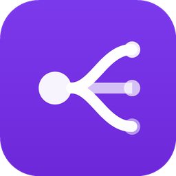

<p align="center">
  
</p>

<h1 align="center">Conductor</h1>

<p align="center">
  <strong>Configure your MCP servers once. Use them everywhere.</strong>
</p>

<p align="center">
  <a href="https://github.com/aryabyte21/conductor/releases"></a>
  <a href="https://github.com/aryabyte21/conductor/actions"></a>
  <a href="https://github.com/aryabyte21/conductor/blob/main/LICENSE"></a>
  <a href="https://github.com/aryabyte21/conductor/releases"></a>
</p>

<p align="center">
  Conductor is a local-first desktop app that manages <a href="https://modelcontextprotocol.io">MCP (Model Context Protocol)</a> server configurations across every major AI coding tool. One source of truth, automatic sync, secrets in your system keychain.
</p>

---

## Why Conductor?

Every AI coding tool has its own config file format for MCP servers. Add a new server? Edit 5 different JSON/TOML/XML files. Change an API key? Do it again. Conductor fixes this.

- **One config to rule them all** &mdash; Manage servers in Conductor, sync to every client with one click
- **Auth once, use everywhere** &mdash; OAuth tokens and API keys stored in your system keychain, injected at sync time
- **Format translation** &mdash; Automatically handles JSON, TOML, XML differences between clients
- **Merge, don't overwrite** &mdash; Sync preserves servers you've added directly in each client
- **Backup & safety** &mdash; Timestamped backups before every config write

## Supported Clients

| Client | Format | Config Path (macOS) |
|--------|--------|---------------------|
| Claude Desktop | JSON | `~/Library/Application Support/Claude/claude_desktop_config.json` |
| Cursor | JSON | `~/.cursor/mcp.json` |
| VS Code (Copilot) | JSON | `~/Library/Application Support/Code/User/mcp.json` |
| Claude Code CLI | JSON | `~/.claude/settings.json` |
| Windsurf | JSON | `~/.codeium/windsurf/mcp_config.json` |
| Zed | JSON | `~/.config/zed/settings.json` |
| JetBrains IDEs | XML | `~/Library/Application Support/JetBrains/*/options/mcp.xml` |
| OpenAI Codex CLI | TOML | `~/.codex/config.toml` |

## Features

### Server Management
Add, edit, delete, and toggle MCP servers with a clean UI. Supports both stdio and HTTP transports.

### Registry Browse
Search and install from 7,300+ MCP servers on the [Smithery Registry](https://registry.smithery.ai). One-click install with automatic config generation.

### Cross-Client Sync
Push your server config to every detected client. Conductor reads each client's native format, merges your servers in, and preserves anything the client had before.

### MCP Stacks
Bundle a set of servers into a shareable stack. Export as JSON, import from a URL or paste. Great for team onboarding.

### Keychain Secrets
API keys and OAuth tokens are stored in your system keychain (macOS Keychain, Windows Credential Manager, Linux Secret Service). They're injected into client configs at sync time &mdash; never stored in plaintext config files.

### Activity Log
Every sync, import, server add/delete is logged with timestamps. See exactly what changed and when.

### File Watcher
Conductor watches client config files for external changes and updates its detection status in real-time.

## How It Works

```
                    ┌─────────────┐
                    │  Conductor  │
                    │  (master    │
                    │   config)   │
                    └──────┬──────┘
                           │
           ┌───────┬───────┼───────┬───────┐
           ▼       ▼       ▼       ▼       ▼
        Claude  Cursor  VS Code  Wind-   Claude
        Desktop                  surf    Code
```

1. **Import** &mdash; Conductor scans your installed AI tools and imports existing MCP server configs
2. **Manage** &mdash; Add, edit, and organize servers in one UI. Secrets go to your system keychain.
3. **Sync** &mdash; Push your config to every client with one click. Format differences handled automatically.

## Installation

### Download

Download the latest `.dmg` from [GitHub Releases](https://github.com/aryabyte21/conductor/releases).

### Build from Source

```bash
git clone https://github.com/aryabyte21/conductor.git
cd conductor
pnpm install
pnpm build:desktop
```

The `.dmg` will be in `apps/desktop/src-tauri/target/release/bundle/dmg/`.

## Development

### Prerequisites

- Rust 1.75+
- Node.js 20+
- pnpm 10+
- Xcode Command Line Tools (macOS)

### Setup

```bash
git clone https://github.com/aryabyte21/conductor.git
cd conductor
pnpm install
```

### Run

```bash
# Desktop app (Tauri + React)
pnpm dev:desktop

# Landing page (Next.js)
pnpm dev:web
```

### Type Check

```bash
pnpm type-check
```

## Architecture

```
conductor/
├── apps/
│   ├── desktop/          # Tauri v2 + React + TypeScript
│   │   ├── src/          # React frontend (Tailwind, Zustand, Vite)
│   │   └── src-tauri/    # Rust backend
│   │       ├── src/
│   │       │   ├── clients/     # Client adapters (detect, read, write)
│   │       │   ├── commands/    # Tauri IPC command handlers
│   │       │   ├── config/      # Config read/write, serializers, normalizers
│   │       │   ├── oauth/       # OAuth flow with local callback server
│   │       │   └── watcher.rs   # File system watcher
│   │       └── Cargo.toml
│   └── web/              # Next.js landing page
├── packages/
│   └── types/            # Shared TypeScript types
└── package.json          # pnpm monorepo root
```

### Key Design Decisions

- **Merge-based sync**: Serializers preserve client-specific servers not managed by Conductor
- **Keychain-backed secrets**: `secret_env_keys` on each server marks which env vars are stored in the OS keychain
- **Adapter pattern**: Each client implements `ClientAdapter` trait with `detect()`, `read_servers()`, `write_servers()`
- **Backup before write**: Every config write creates a timestamped `.bak` file

## Contributing

Contributions are welcome. Please open an issue first to discuss what you'd like to change.

## License

MIT
